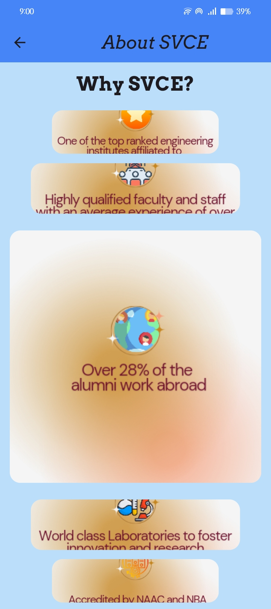
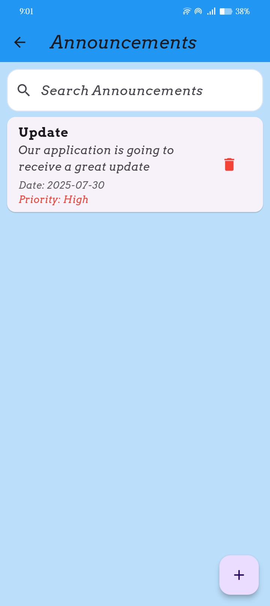
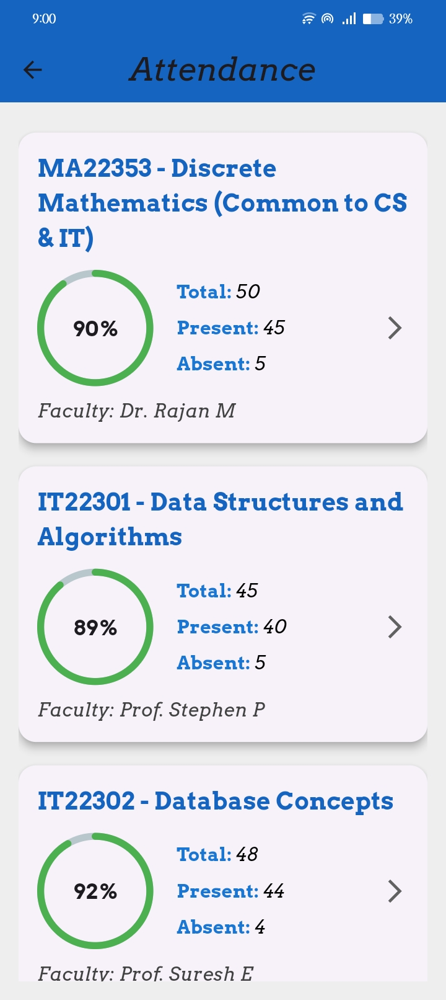
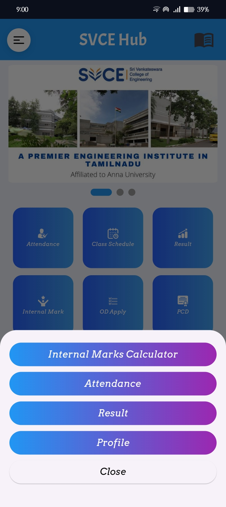
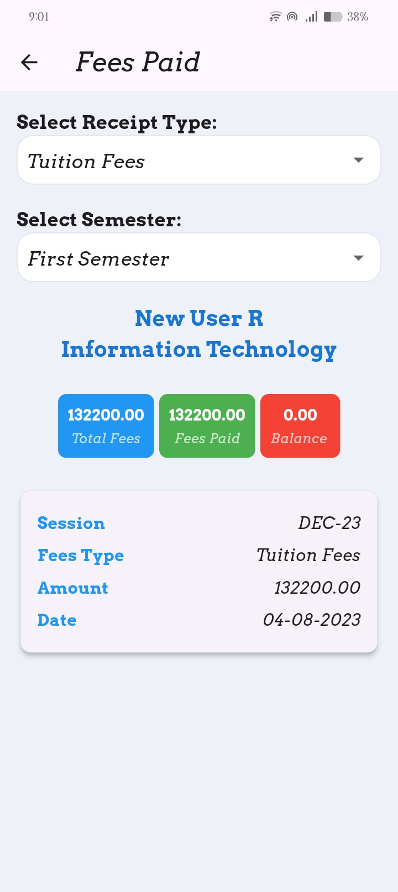
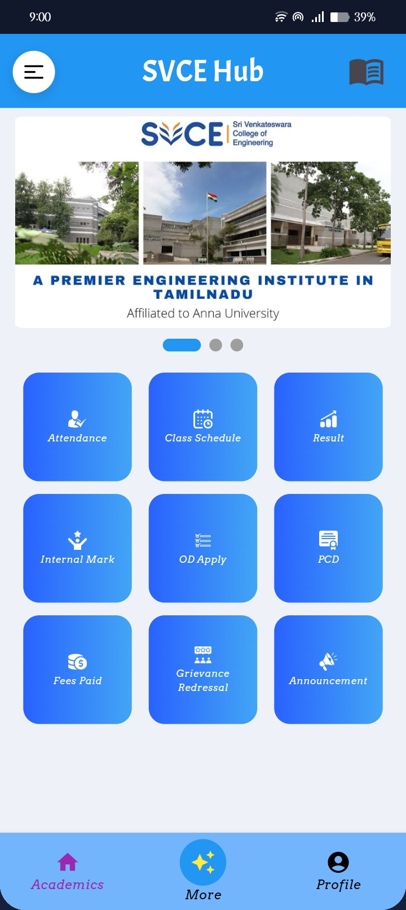
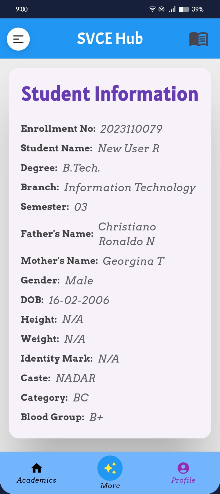
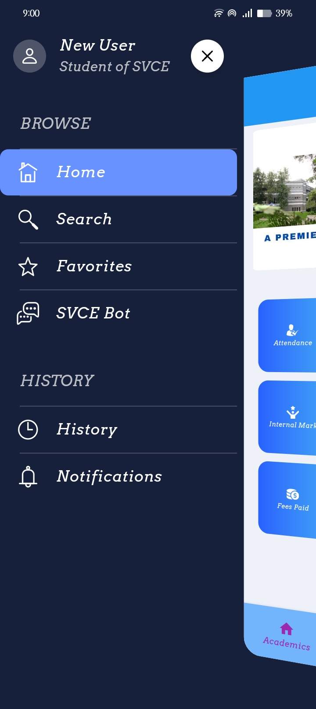
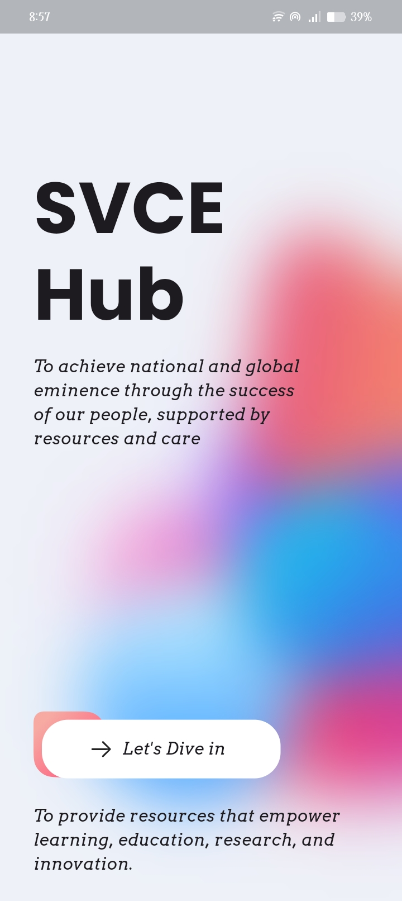

# SVCE Hub – Student Management Mobile App

---

### Screenshots

  &nbsp;
  &nbsp;
  &nbsp;
  &nbsp;
  &nbsp;
  &nbsp;
  &nbsp;
  &nbsp;
  

---

### Project Title

**SVCE Hub** – A feature-rich Student Management Mobile App for Sri Venkateswara College of Engineering (SVCE)

---

### Project Description

SVCE Hub is a robust and elegant mobile application developed using Flutter to serve the students of Sri Venkateswara College of Engineering. It facilitates seamless access to critical academic and administrative information such as attendance records, fee status, announcements, and personalized student profiles. Designed with an MVVM architecture and powered by Firebase backend services, the app ensures real-time updates, secure authentication, and exceptional user experience across Android and iOS platforms.

---

### Features

- **Real-time Announcements:** Stay updated with instant notifications and live feed of college announcements.
- **Subject-wise Attendance Tracking:** Monitor attendance percentages efficiently with visually clear stats.
- **Fees Module:** View detailed fee payment history and current status to keep your finances transparent.
- **Comprehensive Home Dashboard:** Single view with summary cards for quick insights.
- **Personalized Student Info:** Access academic details and profiles securely.
- **Smooth Navigation:** Intuitive bottom navigation bar for effortless module switching.
- **Secure Authentication:** Firebase Authentication integrated with institutional login credentials.
- **Reactive State Management:** Implements Provider for scalable and maintainable state control.
- **Cross-platform Compatibility:** Developed in Flutter ensuring native-like performance on Android & iOS.
- **Modular Clean Architecture:** MVVM pattern maintaining clear separation of concerns for easier development and maintenance.
- **Custom Theming & Icons:** Tailored UI elements for consistent branding and user-friendly experience.

---

### Usage

Once installed, the app is straightforward to use:

- Open the app and sign in using your institutional credentials (via Firebase Authentication).
- Use the bottom navigation bar to switch between modules:
- **Home:** Get a summary overview.
- **Announcements:** View latest college notifications.
- **Attendance:** Track your attendance per subject.
- **Fees:** Check fee status and payment history.
- **Student Info:** Access your profile and academic data.

---

### Contribution

Contributions are welcome and appreciated! To contribute:

1. Fork this repository.
2. Create a new branch `feature/YourFeatureName`.
3. Commit your changes with clear messages.
4. Push your branch and create a Pull Request.
5. Please ensure code follows Flutter and Dart best practices and includes relevant tests.

For major changes, please open an issue before making a pull request to discuss your plans.

---

Thank you for your interest in SVCE Hub!  
Built with 💙 using Flutter and Firebase for enhanced mobile student experience.